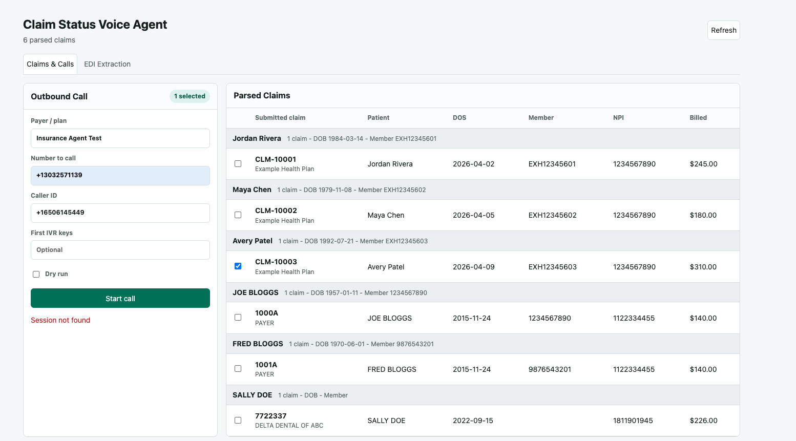
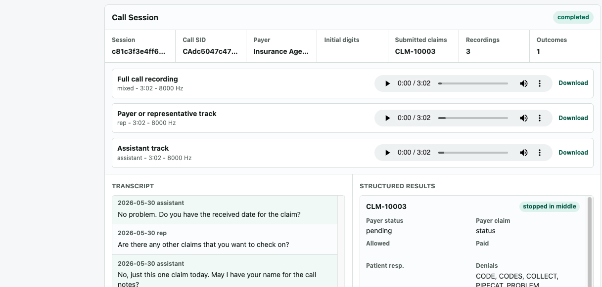

# Claim Status Voice Agent 

FastAPI and Pipecat MVP for outbound payer calls. The app can load normalized claim JSON or import raw 837 EDI files, lets a user select up to 3 claims, places an outbound Twilio call, streams the call into a voice agent, and writes transcript plus 835-like structured results to local session storage.

The WebUI supports selecting parsed claims and reviewing live call/session output.
The screenshots below show the claims list and status/result panels used for the MVP.





## What It Does

- Loads normalized claim inputs from `data/claims.json`.
- Imports raw X12 837 claim files through a deterministic parser and saves them back to `data/claims.json`.
- Serves a web dashboard at `/`.
- Starts outbound Twilio calls from `POST /api/calls`.
- Returns TwiML from `/twiml/{session_id}` with `<Connect><Stream>`.
- Runs a Pipecat voice bot on `/ws`.
- Navigates IVRs with an OpenAI tool call that emits keypad tones into the live media stream.
- Records a per-claim agent outcome tool call with workflow status, payer status, 835-like details, missing fields, and a summary.
- Supports optional initial post-answer digits through Twilio `send_digits`.
- Saves transcript turns and extracts claim-status results after the call ends.
- Saves local Pipecat-side WAV recordings for completed calls and links them from the call session.

## Local Setup

```bash
cd claim-status-agent
cp .env.example .env
uv sync
uv run server.py
```

Open:

```text
http://localhost:7860
```

For real Twilio calls, expose the server and set `LOCAL_SERVER_URL`:

```bash
ngrok http 7860
```

Set these values in `.env`:

```text
OPENAI_API_KEY=
OPENAI_LLM_MODEL=gpt-4.1-mini
OPENAI_STT_MODEL=gpt-realtime-whisper
CARTESIA_API_KEY=
TWILIO_ACCOUNT_SID=
TWILIO_AUTH_TOKEN=
LOCAL_SERVER_URL=https://your-ngrok-url.ngrok.io
```

For UI-only testing without Twilio credentials, check `Dry run` in the web form or set:

```text
DRY_RUN_CALLS=true
```

## Local Call Recordings

Local Pipecat-side recording is enabled by default for `ENV=local`. During a live call, `claim_status_agent/voice/bot.py` inserts Pipecat's `AudioBufferProcessor` after `transport.output()` and saves WAV files under:

```text
data/recordings/{session_id}/
```

Each completed call can save:

- `mixed.wav` - stereo full-call recording.
- `rep.wav` - payer or representative track.
- `assistant.wav` - assistant track.

The dashboard renders audio players in the call session. The session API also returns recording metadata, and each file is served at:

```text
/api/calls/{session_id}/recordings/{recording_id}
```

Configure recording with:

```text
LOCAL_RECORDINGS_ENABLED=true
RECORDINGS_DIR=./data/recordings
LOCAL_RECORDING_SAMPLE_RATE=8000
```

Run tests:

```bash
uv run pytest
```

## Parsed Claim JSON

The default path is:

```text
data/claims.json
```

Override it with:

```text
CLAIMS_JSON_PATH=/absolute/path/to/parsed_837.json
```

The loader accepts either a list of claims or an object with a `claims` array. It normalizes common parsed 837 field names into `ClaimInput` in `claim_status_agent/core/models.py`.

## Raw 837 EDI Import

Use the dashboard's `EDI Import` panel to upload a raw `.edi`, `.x12`, or `.txt` 837 claim file. The deterministic parser in `claim_status_agent/claims/edi_parser.py` reads X12 segments directly, groups parsed claims by patient, upserts claims by `claim_id`, and rewrites the configured claims JSON file.

The upload form supports optional payer name and payer phone overrides. Use the payer phone override when the EDI file only contains clearinghouse or submitter contact numbers.

## IVR Notes

The live bot exposes a `press_keypad` tool to the OpenAI LLM. When the IVR asks for a keypad selection, the tool sends Pipecat DTMF frames; on Twilio bidirectional Media Streams those are delivered as outbound audio tones because Twilio does not support outbound DTMF WebSocket events.

The live bot also exposes `record_claim_outcome`. The agent should call it at the end of each claim discussion before moving to the next claim or closing the call, so the session includes an explicit workflow status, payer status, submitted claim ID, payer claim number, 835-like payment/denial fields, missing fields, and summary. If the call disconnects before the tool is called, `claim_status_agent/voice/bot.py` creates fallback outcomes for claims missing an agent-recorded outcome.

Use the dashboard's `Initial digits` field or the API's `initial_keypad_digits` value for known extensions or access codes that should be dialed immediately after the payer answers. Allowed initial characters are `0-9`, `A-D`, `*`, `#`, `w`, and `W`, with `w`/`W` as pauses.

## Project Layout

- `server.py` - compatibility entrypoint for `uv run server.py`.
- `bot.py` - compatibility export for Pipecat bot discovery.
- `claim_status_agent/api/` - FastAPI routes, Twilio call creation, and TwiML generation.
- `claim_status_agent/claims/` - 837 parsing, claim normalization, claim storage, and transcript extraction.
- `claim_status_agent/core/` - settings, Pydantic models, and voice-agent prompt construction.
- `claim_status_agent/sessions/` - persisted call/session state.
- `claim_status_agent/voice/` - Pipecat pipeline, IVR tools, outcome tools, and local recording helpers.
- `static/` - vanilla HTML/CSS/JS dashboard.
- `data/claims.json` - local claim fixture data used by the dashboard.
- `samples/` - sample EDI files and reference docs.
- `docs/architecture/` - diagrams for the data import, call lifecycle, and live agent loop.
