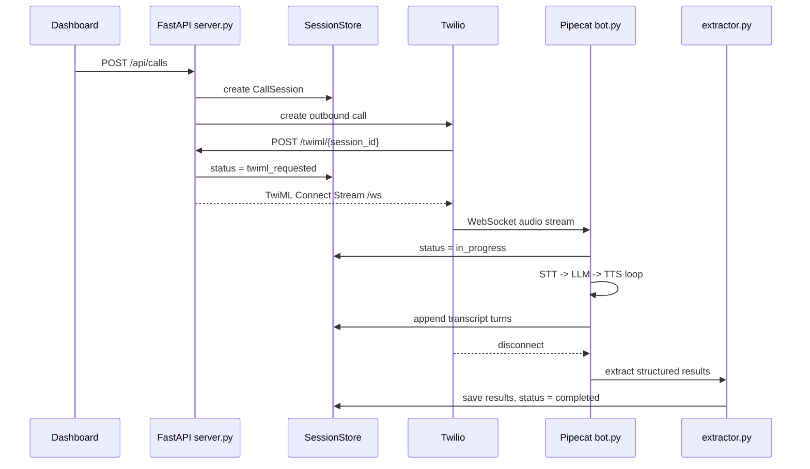

# Call Lifecycle

```mermaid
sequenceDiagram
  participant UI as Dashboard
  participant API as FastAPI server.py
  participant Store as SessionStore
  participant Twilio
  participant Bot as Pipecat bot.py
  participant Extractor as extractor.py

  UI->>API: POST /api/calls
  API->>Store: create CallSession
  API->>Twilio: create outbound call
  Twilio->>API: POST /twiml/{session_id}
  API->>Store: status = twiml_requested
  API-->>Twilio: TwiML Connect Stream /ws
  Twilio->>Bot: WebSocket audio stream
  Bot->>Store: status = in_progress
  Bot->>Bot: STT -> LLM -> TTS loop
  Bot->>Store: append transcript turns
  Twilio-->>Bot: disconnect
  Bot->>Extractor: extract structured results
  Extractor->>Store: save results, status = completed
```
