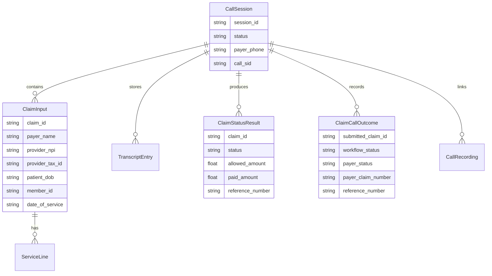

# Data Model

```mermaid
erDiagram
  CallSession ||--o{ ClaimInput : contains
  CallSession ||--o{ TranscriptEntry : stores
  CallSession ||--o{ ClaimStatusResult : produces
  CallSession ||--o{ ClaimCallOutcome : records
  CallSession ||--o{ CallRecording : links
  ClaimInput ||--o{ ServiceLine : has

  ClaimInput {
    string claim_id
    string payer_name
    string provider_npi
    string provider_tax_id
    string patient_dob
    string member_id
    string date_of_service
  }

  CallSession {
    string session_id
    string status
    string payer_phone
    string call_sid
  }

  ClaimStatusResult {
    string claim_id
    string status
    float allowed_amount
    float paid_amount
    string reference_number
  }

  ClaimCallOutcome {
    string submitted_claim_id
    string workflow_status
    string payer_status
    string payer_claim_number
    string reference_number
  }
```
