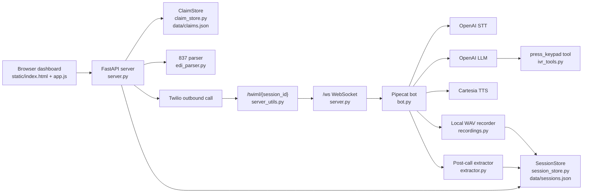

# System Map

```mermaid
flowchart LR
  UI["Browser dashboard\nstatic/index.html + app.js"] --> API["FastAPI server\nserver.py"]

  API --> Claims["ClaimStore\nclaim_store.py\ndata/claims.json"]
  API --> Sessions["SessionStore\nsession_store.py\ndata/sessions.json"]
  API --> EDI["837 parser\nedi_parser.py"]

  API --> Twilio["Twilio outbound call"]
  Twilio --> TwiML["/twiml/{session_id}\nserver_utils.py"]
  TwiML --> WS["/ws WebSocket\nserver.py"]

  WS --> Bot["Pipecat bot\nbot.py"]
  Bot --> STT["OpenAI STT"]
  Bot --> LLM["OpenAI LLM"]
  LLM --> Tool["press_keypad tool\nivr_tools.py"]
  Bot --> TTS["Cartesia TTS"]
  Bot --> Recorder["Local WAV recorder\nrecordings.py"]
  Bot --> Extractor["Post-call extractor\nextractor.py"]

  Extractor --> Sessions
  Recorder --> Sessions
```
