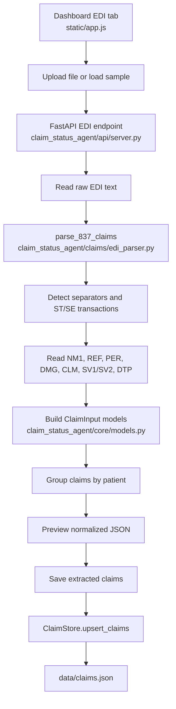

# EDI Import Flow

```mermaid
flowchart TD
  A["Dashboard EDI tab\nstatic/app.js"] --> B["Upload file or load sample"]
  B --> C["FastAPI EDI endpoint\nclaim_status_agent/api/server.py"]
  C --> D["Read raw EDI text"]
  D --> E["parse_837_claims\nclaim_status_agent/claims/edi_parser.py"]
  E --> F["Detect separators and ST/SE transactions"]
  F --> G["Read NM1, REF, PER, DMG, CLM, SV1/SV2, DTP"]
  G --> H["Build ClaimInput models\nclaim_status_agent/core/models.py"]
  H --> I["Group claims by patient"]
  I --> J["Preview normalized JSON"]
  J --> K["Save extracted claims"]
  K --> L["ClaimStore.upsert_claims"]
  L --> M["data/claims.json"]
```
