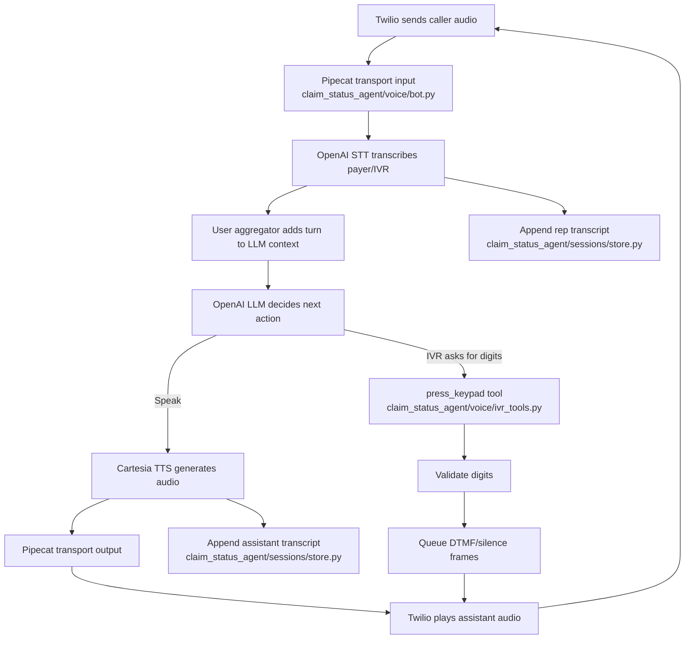

# Live Agentic Loop

```mermaid
flowchart TD
  A["Twilio sends caller audio"] --> B["Pipecat transport input\nclaim_status_agent/voice/bot.py"]
  B --> C["OpenAI STT transcribes payer/IVR"]
  C --> D["User aggregator adds turn to LLM context"]
  D --> E["OpenAI LLM decides next action"]

  E -->|Speak| F["Cartesia TTS generates audio"]
  F --> G["Pipecat transport output"]
  G --> H["Twilio plays assistant audio"]

  E -->|IVR asks for digits| I["press_keypad tool\nclaim_status_agent/voice/ivr_tools.py"]
  I --> J["Validate digits"]
  J --> K["Queue DTMF/silence frames"]
  K --> H

  C --> L["Append rep transcript\nclaim_status_agent/sessions/store.py"]
  F --> M["Append assistant transcript\nclaim_status_agent/sessions/store.py"]

  H --> A
```
