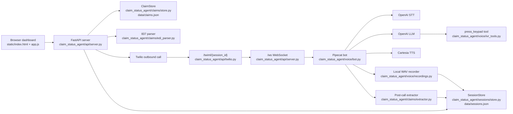

# System Map

```mermaid
flowchart LR
  UI["Browser dashboard\nstatic/index.html + app.js"] --> API["FastAPI server\nclaim_status_agent/api/server.py"]

  API --> Claims["ClaimStore\nclaim_status_agent/claims/store.py\ndata/claims.json"]
  API --> Sessions["SessionStore\nclaim_status_agent/sessions/store.py\ndata/sessions.json"]
  API --> EDI["837 parser\nclaim_status_agent/claims/edi_parser.py"]

  API --> Twilio["Twilio outbound call"]
  Twilio --> TwiML["/twiml/{session_id}\nclaim_status_agent/api/twilio.py"]
  TwiML --> WS["/ws WebSocket\nclaim_status_agent/api/server.py"]

  WS --> Bot["Pipecat bot\nclaim_status_agent/voice/bot.py"]
  Bot --> STT["OpenAI STT"]
  Bot --> LLM["OpenAI LLM"]
  LLM --> Tool["press_keypad tool\nclaim_status_agent/voice/ivr_tools.py"]
  Bot --> TTS["Cartesia TTS"]
  Bot --> Recorder["Local WAV recorder\nclaim_status_agent/voice/recordings.py"]
  Bot --> Extractor["Post-call extractor\nclaim_status_agent/claims/extractor.py"]

  Extractor --> Sessions
  Recorder --> Sessions
```
